<div align="center" style="font-size:60px;">
SocialOrange
</div>

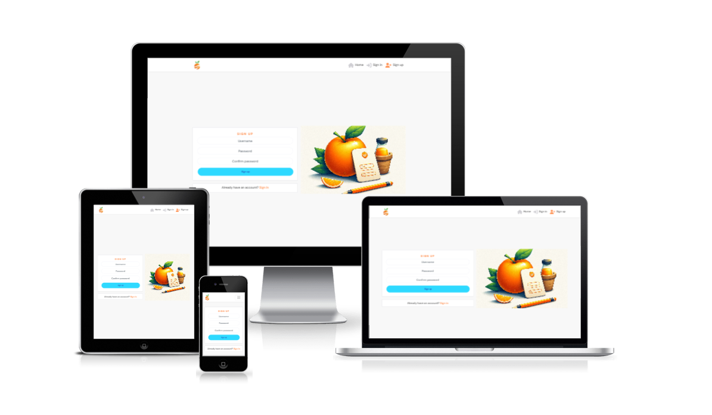

## Table of Contents
- [Introduction](#introduction)
- [Content](#content)
    - [Wireframe](#wireframe)
    - [FeaturesPictures](#featurepictures)
    - [Colorsheme](#colorsheme)
    - [Language](#language)
- [Features](#features)
- [Installation](#installation)
- [Api](#api)
- [Tests](#tests)
     - [Validation](#validation)
- [Bugs/Errors](#bugs/errors)
- [Program Used](#programused)
- [Credits](#credits)
- [Acknowledgements](#acknowledgements)

## Introduction

Welcome to our vibrant social media platform SocialOrange, designed to bring people together, share moments, and foster meaningful connections. Our platform is more than just a place to post pictures and comments; it's a community where you can make friends, like pictures, and much more.

## Content

### Wireframe

Sign up        |  Sign in
:-------------------------:|:-------------------------:
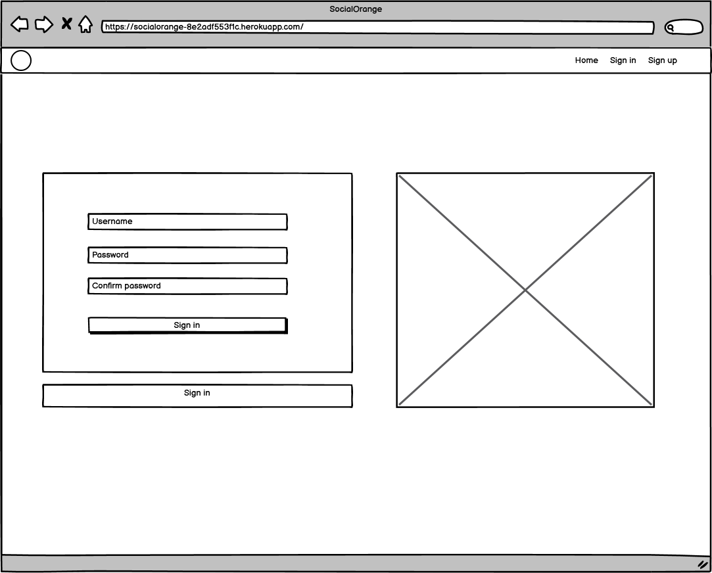  |  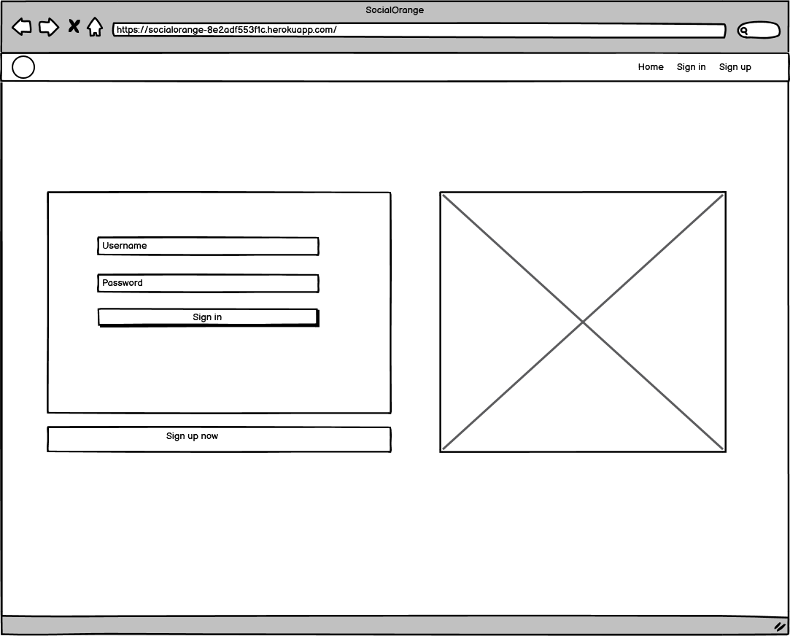

Profile        |  Home
:-------------------------:|:-------------------------:
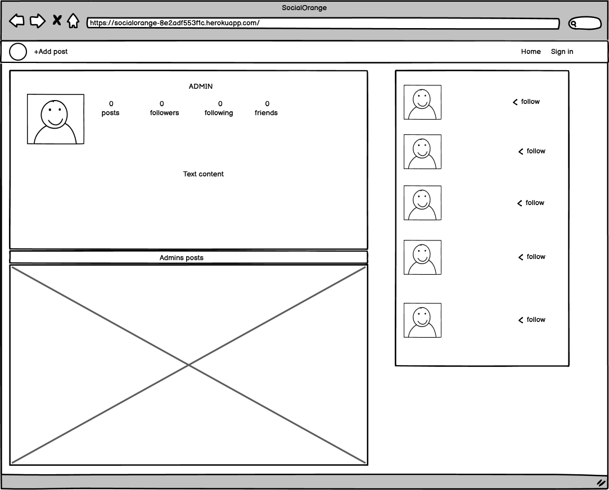  |  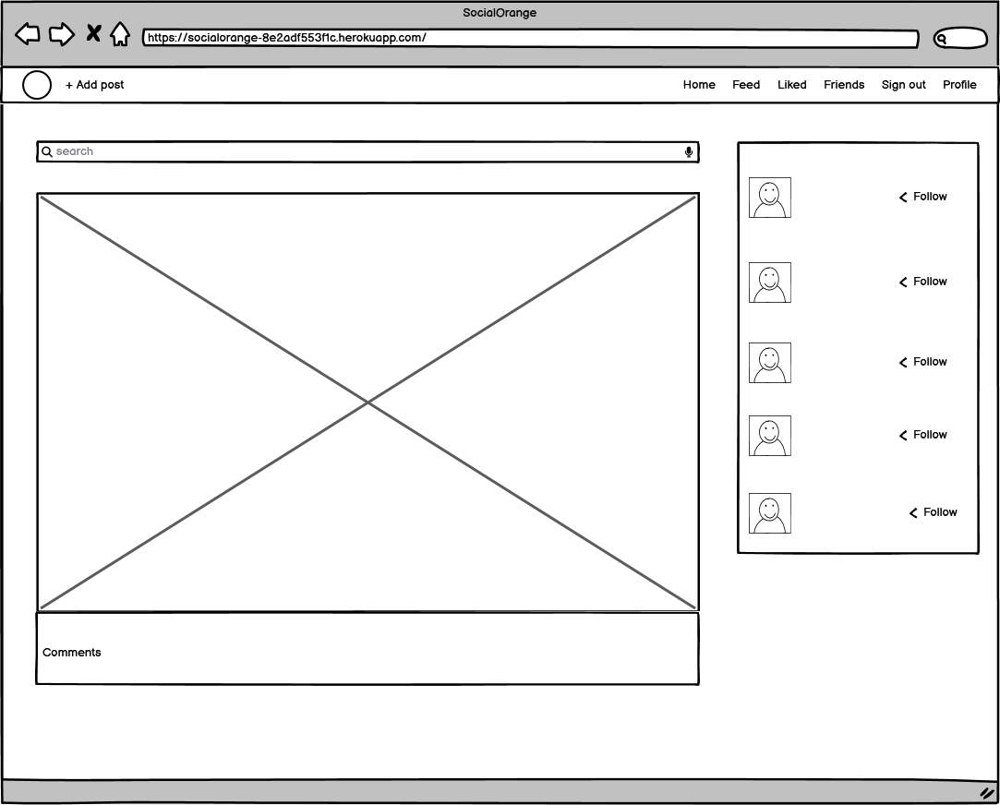
<div align="center" style="font-size:20px;">
Post
</div>
<p align="center">
  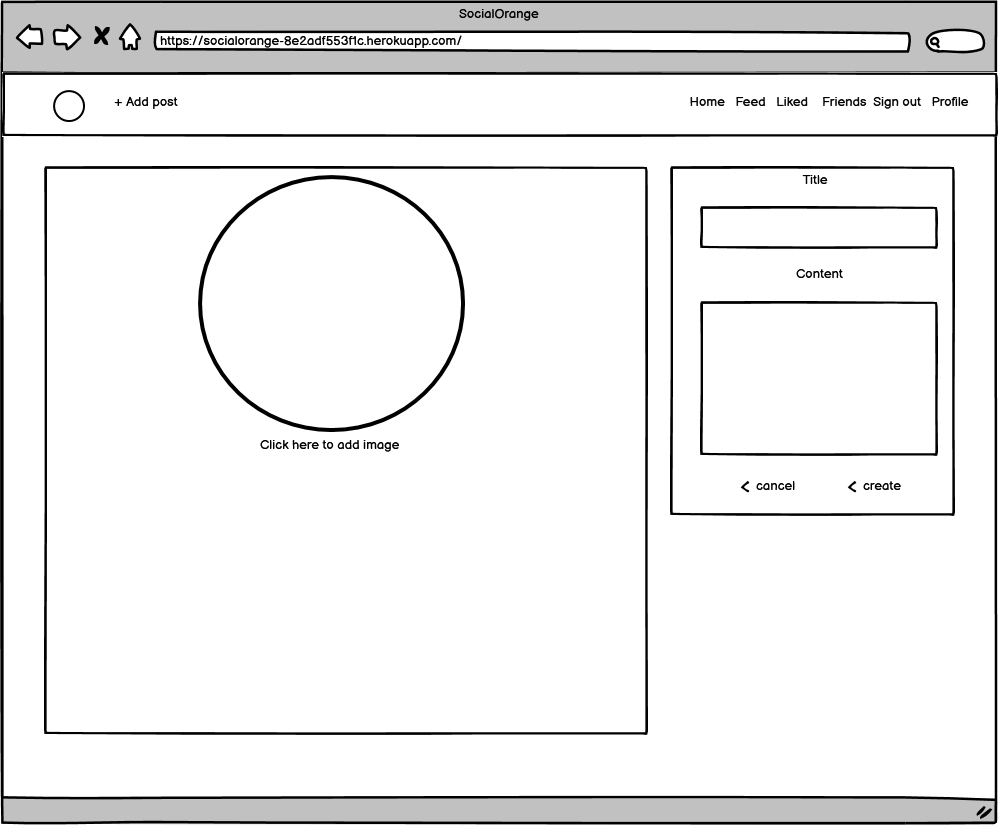
</p> 
<div align="center" style="font-size:20px;">
Mobile view
</div>
<p align="center">
  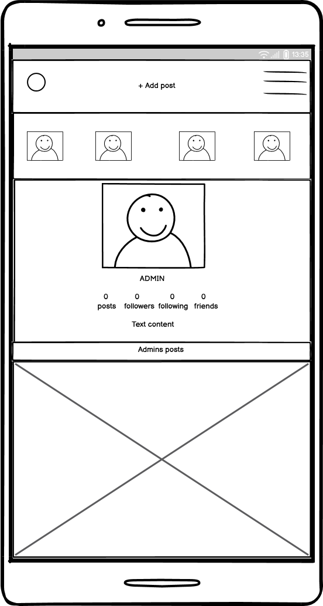
</p>


### Feature pictures

Sign up        |  Sign in
:-------------------------:|:-------------------------:
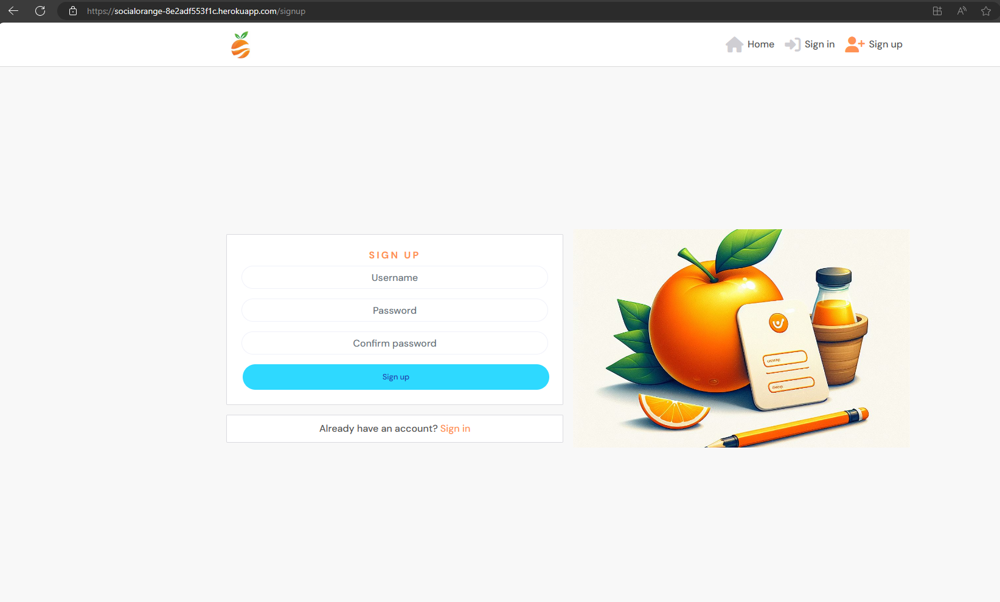  |  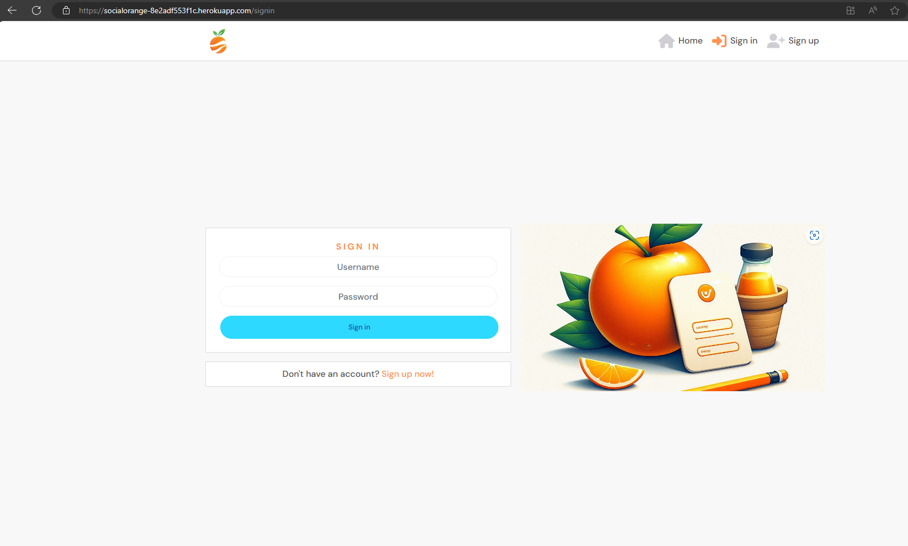

Profile        |  Home
:-------------------------:|:-------------------------:
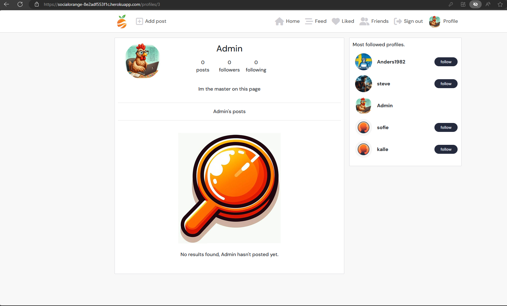  |  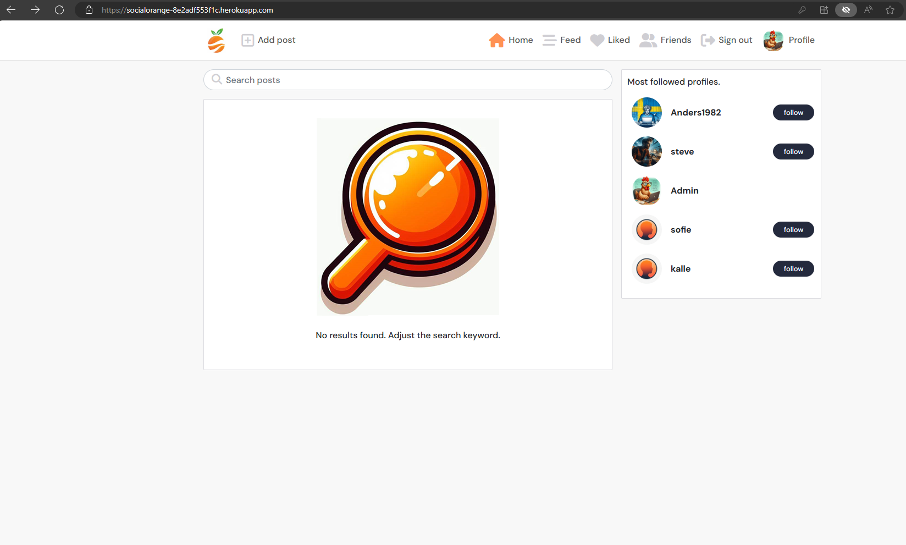

<div align="center" style="font-size:20px;">
Post
</div>      

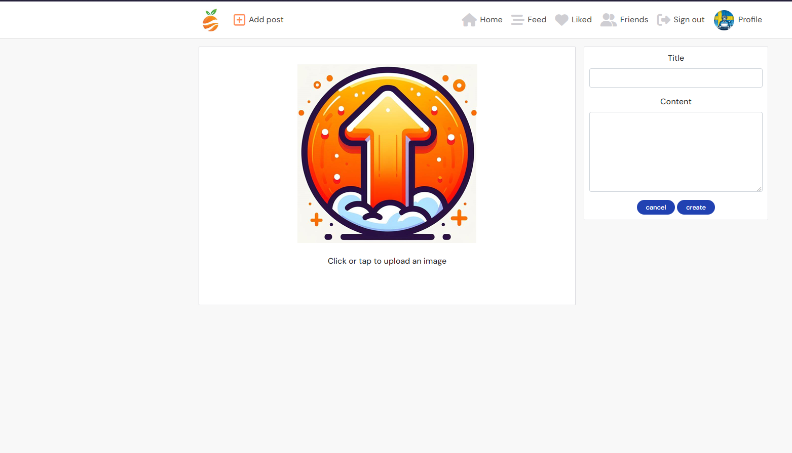
<div align="center" style="font-size:20px;">
Mobile view
</div>
<p align="center">
  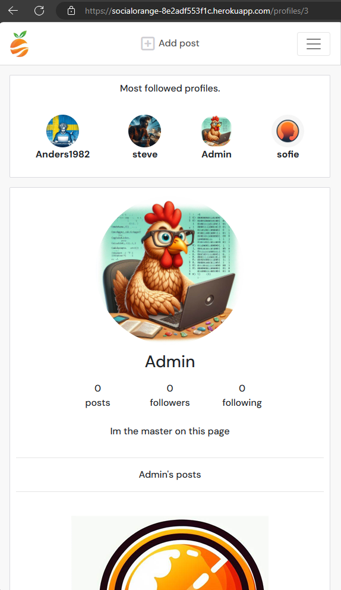
</p>

## Colorsheme

<div align="center" style="font-size:20px;">
Colorsheme
</div>
<p align="center">
  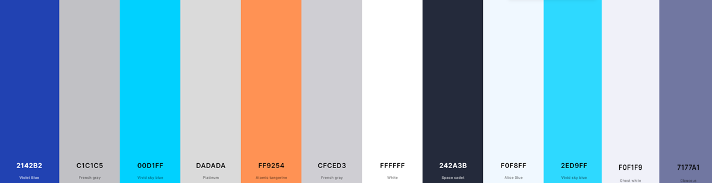
</p>

## Language

<div align="center" style="font-size:20px;">
Language
</div>
<p align="center">
  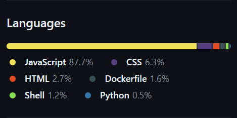
</p>

## Features

- Post Pictures: Share your life's moments with the world. Whether it's a    beautiful sunset, a delicious meal, or a funny meme, our platform is the perfect place to showcase your creativity and personality.
- Comments: Engage with your friends and the community. Leave comments on posts, share your thoughts, and start conversations.
- Make Friends: Connect with like-minded individuals from around the globe. Explore profiles, send friend requests, and build a network of friends.
- Like Pictures: Express your appreciation for others' content. Like posts that inspire you, make you smile, or simply make you feel good.

### Future functions

Block users

We are planning to introduce a feature that allows users to block other users. This feature will enable users to prevent unwanted interactions and maintain a safe and respectful environment within the community.

Benefits:

- Enhances user safety and privacy.
- Reduces distractions and spam.
- Improves the overall user experience by focusing on meaningful interactions.

Implementation:

- Users will have the option to block other users directly from their profiles.
- Blocked users will not be able to send messages, comments, or access personal information of the blocked user.
- Admins will have the ability to review and manage block requests to ensure fairness and compliance with community guidelines.

Direct Chat with friends

We aim to introduce a direct chat feature that allows users to communicate privately with their friends or colleagues. This feature will facilitate quick and confidential discussions, enhancing collaboration and support within the community.

Benefits:

- Facilitates quick and confidential communication.
- Enhances collaboration and support among friends and colleagues.
- Reduces the need for public discussions, ensuring privacy and confidentiality.

Implementation:

- Users will be able to initiate a direct chat with friends or colleagues from their profile or within the community.
- Direct chats will be accessible only to the participants, ensuring privacy and confidentiality.
- Users will have the option to share chat history with friends or colleagues for future reference or collaboration.

## How to get started

- Create an Account: Sign up with your username you want to have to get started.
- Customize Your Profile: Add a profile picture, bio, and interests to personalize your profile and make it easier for others to find you.
- Explore and Connect: Browse through posts, comment on those that interest you, and don't forget to like the ones you enjoy.
- Engage with the Community: Follow friends and participate in discussions to become an active member of our community.
## Installation

- Install Git: First, you need to have Git installed on your system. If you're using Debian or Ubuntu, you can install Git by running the following commands in your terminal:

```
sudo apt-get update
sudo apt-get install git -y
```

- For Windows, you can download and install Git from its official website 2.

- Configure Git: After installing Git, configure your username and email which will be used for your commits. Replace First Last and example@example.com with your actual name and email:
```
git config --global user.name "First Last"
git config --global user.email "example@example.com"
```
Clone the Repository: ``https://github.com/AndersH82/socialorange.git``

- Navigate to the Repository Directory: After cloning, navigate to the newly created directory which contains the cloned repository:

```
cd repository
```
- Pull the Latest Changes: To ensure you have the latest version of the repository, run:

```
git pull
```

- This command fetches the latest changes from the remote repository and merges them into your local copy 1.

- Make Changes (Optional): If you want to contribute to the repository, you can make changes to the files, add them to the staging area with git add ., commit the changes with git commit -m "Your commit message", and then push the changes back to the remote repository with git push.

- Create a Pull Request (Optional): If you've made changes and want them to be reviewed and potentially merged into the original repository, you can create a pull request on GitHub. This involves pushing your changes to your forked repository on GitHub and then initiating a pull request from your forked repository to the original repository.

- Remember, if you're working with a repository that requires two-factor authentication (2FA), you might need to use SSH instead of HTTPS for cloning and pushing changes

## API

- When you have cloned the SocialOrange repository, you should clone another repository and that is SocialOrange-api and it can be found here: ``https://github.com/AndersH82/socialorange-api.git``


**How the API Django Rest Framwork works**

Django REST Framework (DRF) is a powerful toolkit designed to simplify the process of building RESTful APIs with Django. It integrates seamlessly with Django's core features, such as models, views, and URLs, making it straightforward to create a RESTful API. Here's a breakdown of how DRF works:

- Serializers: DRF uses serializers to convert Django QuerySets and model instances to JSON (and other formats like XML and YAML) for serialization, and from JSON for deserialization. Before deserializing incoming data, serializers validate the data's structure, ensuring it matches the expected format. This process is crucial for ensuring that the data communicated over the API is uniform and universal, making it easier for other systems to consume.

- Views and ViewSets: DRF views handle RESTful HTTP requests and responses, similar to traditional Django views but designed to return JSON responses instead of HTML templates. ViewSets, which are a type of view, allow you to combine related views into a single class, reducing the amount of code needed and keeping URLs consistent. ViewSets use actions like .list() and .create() instead of method handlers like .get() and .post(), simplifying the process of handling different HTTP methods.

- Routers: Routers in DRF map views to URLs, making it easier to expose your API endpoints. This mapping is crucial for defining the routes that clients will use to interact with your API.

- Authentication and Permissions: DRF provides comprehensive mechanisms for securing your API endpoints. It includes various authentication classes, such as TokenAuthentication, SessionAuthentication, and JSONWebTokenAuthentication. Permissions can be set to ensure that only authenticated users can access certain endpoints, and these permissions can be customized to fit specific requirements.

- Development and Deployment: DRF simplifies the development cycle of an application, from creating models and serializers to setting up views and URLs. It also supports test-driven development, allowing developers to build robust and secure APIs efficiently. Once developed, DRF APIs can be deployed using various methods, including Docker, to ensure they are accessible to clients.


## Tests

### Validation
- HTML https://validator.w3.org/nu/?doc=https%3A%2F%2Fsocialorange-8e2adf553f1c.herokuapp.com%2F

- CSS https://jigsaw.w3.org/css-validator/validator?uri=https%3A%2F%2Fsocialorange-8e2adf553f1c.herokuapp.com%2F&profile=css3svg&usermedium=all&warning=1&vextwarning=&lang=sv

## Bugs/Errors

I have tried to fix these errors, but I cannot remove them.

<p align="center">
  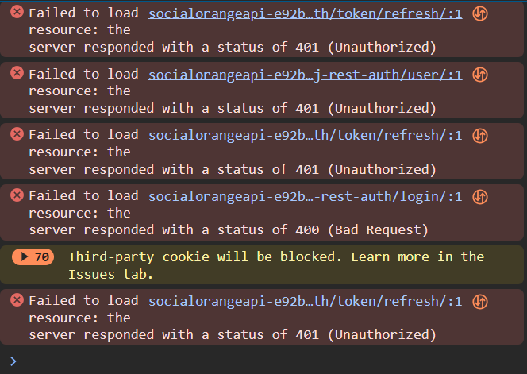
</p>

## Program Used

- Gitpod - coding
- Heroku - deployment
- Github - web-based interface
- Balsamiq Wireframe - make wireframe
- Copilot AI - Make images


## Credits

- Youtube - research for ideas and help
- Phind - for help with codes
- Slack community - for the help of students
- Emil Jadersten_5P on Slack - Was of great help
- Akshat_Garg_mentor on Slack - Mentor


## Join us today

We invite you to join our community and be a part of the fun. Whether you're looking to share your experiences, connect with friends, or simply explore new content, our platform is here to support you. Let's make the most of our shared moments and create a community that's both supportive and inspiring.

## Acknowledgements

It's been incredibly hard hours trying to get this together as a beginner. This was really a test of programming knowledge. I have had to struggle a lot with this PP5 as it has not worked properly. Already when we made Moments and the DRF Framework in CI, it didn't work either and it meant that I had to spend many hours on error codes that no one could help with, not CI either. In the last hours before I have to hand in the project and do the last thing, my Heroku has stopped working because they want payment. I can't complete my Lighthouse tests and won't be able to finish my entire README. I don't know what will happen to my deployment, then you can't see it if it's not online. This would be free during the training. I also can't do all the tests that need to be done as I don't have access to Heroku and it has to be running if I'm going to get any responses from the API